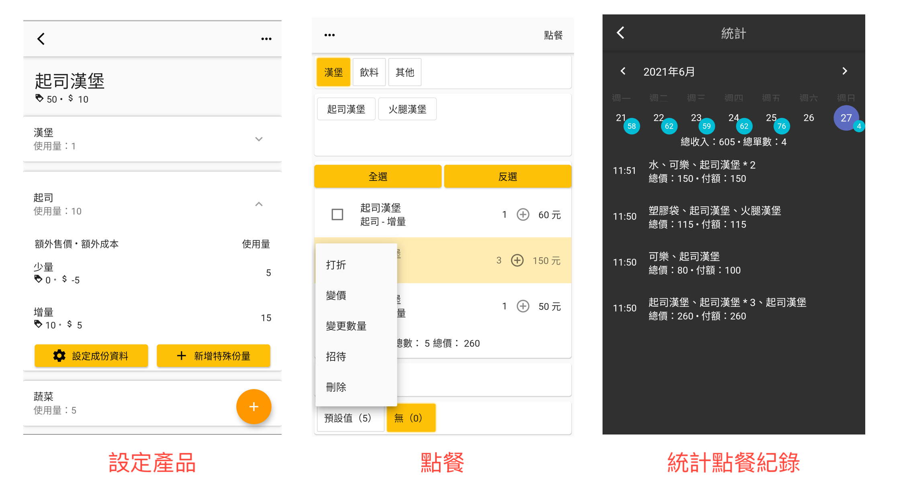

# POS 系統

本 POS 系統的特色。

-   完全允許離線使用
-   本系統不會遠端紀錄個資，只會存在你的手機裡，所以可以安心使用
-   庫存系統幫助你紀錄現有成份庫存
-   設定顧客資訊
-   收銀機方便做每日結餘
-   菜單等資訊 Google 表單備份

## 下載

-   Android 可以至 [Google Play](https://play.google.com/store/apps/details?id=com.evanlu.possystem) 下載。
-   iOS 要再等等，已排程準備。

## 貢獻

想要幫助 POS 系統更完善？我們很樂意你的幫忙！POS 系統是一個開源的專案，並且透過大家一點一點的幫助建構出來的。查看[相關文件](about/contribute.md)暸解如何讓 POS 系統更好！

## 深入瞭解

為了加速你暸解本系統的概略架構，我們也提供了一些簡單的[說明文件](about/structure.md)，希望可以讓你更快融入本專案，對於 Flutter 初學者來說，亦是一個不錯的開始！
