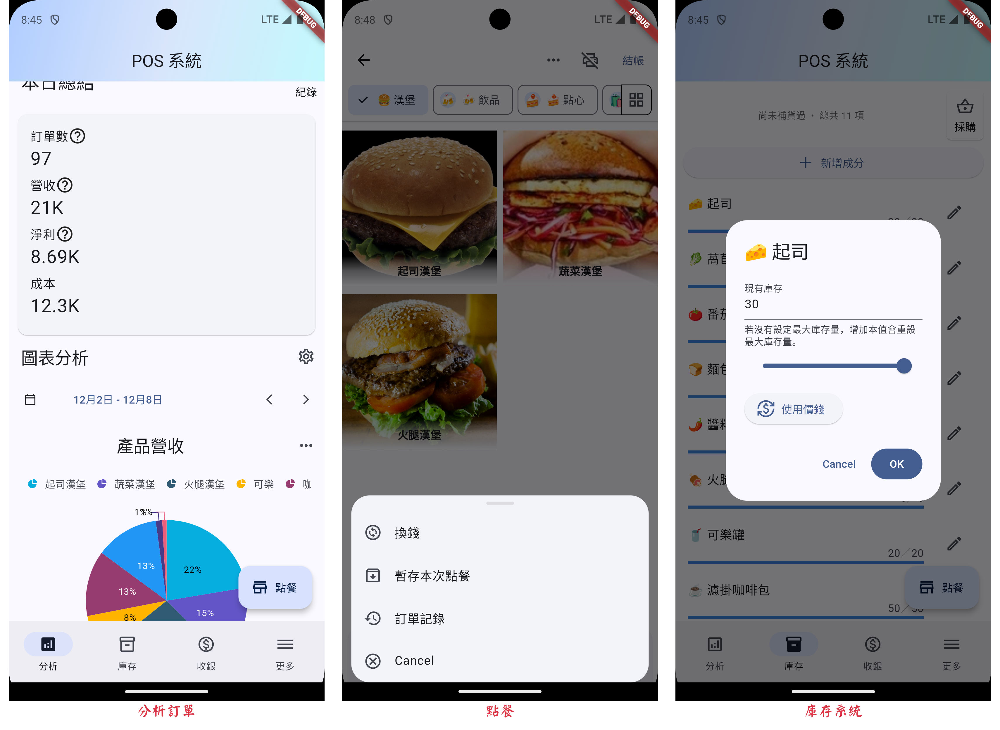

# POS 系統

本 POS 系統是一個開源的 Flutter 應用程式，專為小型餐飲業設計，其功能包括：

- 庫存系統：幫助你紀錄現有成份庫存，追蹤每種食材的數量，並在存量不足時收到通知；
- 顧客資訊：可以在點餐時備註使用者的資訊，例如年齡和性別，幫助分析；
- 收銀機：方便做每日結餘，還有幫助統計現有現金數量；
- 匯出與備份：可以將訂單、菜單等資料匯出到應用程式之外；
- 分析：可以根據您的需求，製作客製化的折線圖、圓餅圖以利分析；
- 出單機：允許透過藍牙列印訂單內容。

設計核心：

- 離線使用：即使沒有網路連線，也能照常使用 POS 系統；
- 不會遠端紀錄個資：所有資料都儲存在您的手機裡，不會傳輸到伺服器；
- 支援大螢幕的操作。

## 下載

- Android 可以至 [Google Play](https://play.google.com/store/apps/details?id=com.evanlu.possystem) 下載。
- iOS 要再等等，已排程準備。

## 開發 & 貢獻

想要幫助 POS 系統更完善？我們很樂意你的幫忙！
POS 系統是一個開源的專案，並且透過大家一點一點的幫助建構出來的。
查看 [Development](https://evan361425.github.io/flutter-pos-system/zh/maintenance/development/)
開始在本地端建置和測試。
查看 [Contributing](https://evan361425.github.io/flutter-pos-system/zh/about/contribute/) 暸解如何讓 POS 系統更好！

## 深入瞭解

為了加速你暸解本系統的概略架構，我們也提供了一些簡單的[說明文件](https://evan361425.github.io/flutter-pos-system/zh/about/structure.md)，
希望可以讓你更快融入本專案，對於 Flutter 初學者來說，亦是一個不錯的開始！
